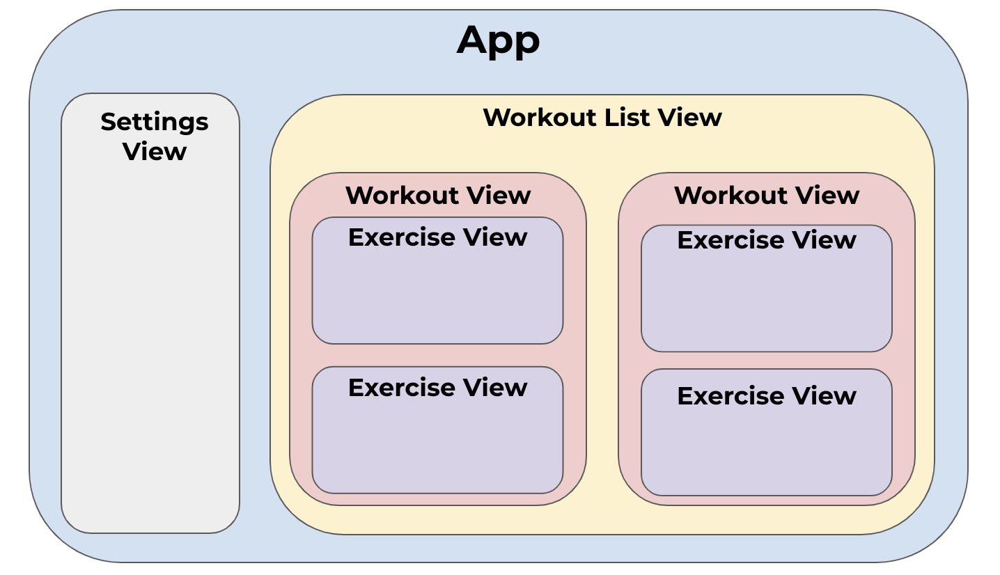

# Apple OS Workout Tracker App

# Introduction

The aim of this project is to build an app to track workouts. I originally tracked my workouts using the default Apple Notes app, which wasn’t very easy to use. I wanted to make a better alternative, and didn’t like the ones I saw on the App Store. I also wanted to make it compatible with any Apple device, and synchronise the content across devices.

# App Structure

The app is built in Swift using the SwiftUI framework. The SwiftUI framework is great as it abstracts a lot of the lower level stuff for displaying content on an apple device. The SwiftUI framework has a single **App** component and within it, contains several **Views**. Views are a type of object as part of SwiftUI, and can be combined together. 

For example, you may use SwiftUI’s `Text` views to show text on the screen, and you can then combine these together (along with other views) to create a view for displaying an exercise (eg. `ExerciseView`). This `ExerciseView` can then be used to build a larger view, for example one that shows a whole workout `WorkoutView`. This structure is explained below:



# Technical Reference

## App

This is the **entrypoint** for the application build, meaning it is the file that is run when the application starts. SwiftUI looks for a class or struct which conforms to SwiftUI’s `App` protocol to use as an entrypoint, and is denoted by the `@main` above it. 

**A computed property is a property whose value must be calculated by running code**. Eg.

```swift
var name: String = "beans"
var text: String {
    "Hello \(name)!"
}
```

Here, the value for `text` must be calculated by running that block. The alternative is a **stored property**, where the value is simply assigned and no calculation needs to be done. Eg.

```swift
var text: String = "hello"
```

The `App` protocol requires the `struct` to have a computed `body` property. This computed property has a return value which conforms to the `Scene` protocol, but its exact type is not made public by the `some` keyword (because it is not necessary). A SwiftUI scene acts as a container for a **view hierarchy**, which is a set of views and the navigational relationships between them. A common scene to use is `WindowGroup`, which allows managing multiple windows on macOS and iPadOS. 

The `WindowGroup` structure takes one parameter which must conform to the `View` protocol, and all SwiftUI views and views built out of these conform to this protocol. The trailing closure syntax is used in many SwiftUI views because the last argument can be a closure. The closure contains the computation, which is often other views.

## WorkoutStore

### Class Description

The WorkoutStore is a central location for storing the workout data. All the information used in the views starts here. This Store is defined in the `App` file and passed to other views. The saving occurs when the `WorkoutListView` becomes inactive, and the loading function is run when the app appears.

WorkoutStore is the class used to save and load workouts. The class must conform to the `ObservableObject` protocol, and any properties of the class that should cause views to be updated upon change are denoted by the `@Published` property wrapper (eg. workouts). An instance of this class is declared in the root App file as a `@StateObject`. In views which need this data, if individual properties are needed, the `@Binding` wrapper is used. If the whole object is needed, the workouts would be passed in as a `@ObservedObject`. 

### Fetch URL Function

There is then a function used to identify the filepath to the user’s documents folder. The function is wrapped as `private`, because it is only called within the class. It is declared as `static`, because it is identical for all instances of the class. This function is a **throwing** function, because it is possible an error can occur which is outside of the developer’s control. In this case, our application is trying to find the path to a location which could not exist, or we don’t have access to it. We know its a throwing function because of the `throws` keyword. Because our function can throw an error, the line of code within that could possibly error has the `try` keyword before it. For example, adding two numbers wouldn’t need a `try` keyword, but the line that fetches the filepath will need it. 

iOS apps are sandboxed and run in isolation from other applications, therefore the directory names are random. We must use Apple’s API to fetch file paths. The `FileManager` class is used to interact with the file system. The `default` method says that we should use the standard shared file manager for our app’s process. The `url` method is the actual method which finds the url of what we are specifying. This method takes several parameters. The application does not have access to system files by default for security reasons, so the `for` parameter is the starting point of where we look. The `.documentDirectory` is where files specific to an app are stored, so they can access them. The `.userDomainmask` is the user’s home directory where we can save files to from the app. The path would be something like `/User_Name/…blah…/appName/Documents`. We append to the path because we want to save the workout data with a name which makes sense.

### Loading Function

The loading function is static because it is identical for all instances of the WorkoutStore class. The completion argument is a closure, which indicates what actions to take depending on whether the load was successful or not. After the argument, we use the `@escaping` wrapper because we load **asynchronously**. This means that other tasks can be completed while a long-running task is completed. The closure used for the `completion` argument could be run after the load function returns, which is why it needs to be escaped. The `completion` closure argument takes in a `Result` object, that specifies which types the load function will give us. The result is then passed to the closure used in the base app file, and depending on success or failure, we do different things in that file. We pass arguments for the success or failure, so we can use them in the closure.

The `DispatchQueue` object manages execution of tasks in series or concurrently on the app’s main thread or a background thread. We try to load in the data on a background thread as the task could take a while, and when it is done, we return the result using the main thread. We don’t want to delay updating the UI from other actions (done on the main thread) because data is loading. We use the global system queue with the `background` quality of service, which is the lowest priority. We give priority to updating the UI, and loading data can take slightly longer. 

We then use a `do` `catch` block because the fetch URL function we want to call could create errors. We first try to get the path of the file we want to load using the previously created function. Then we try to actually read the file. `guard` runs when a condition is not met, in this case the block inside the `guard` statements runs if the `file` variable is `nil` (which is falsey). The `try?` keyword attempts to run the code after, and if there is an error, it returns `nil`. This means that the `guard` block only runs if we fail to read the file (we fail to read the file because it doesn’t exist, so we return an empty array). The `return` returns nothing and stops execution there if the file doesn’t exist. If any of this part fails, we move to the `catch` block.

If we are able to read from the file, we try to decode it from JSON to a Swift object. We need to specify which type to return from the JSON. If this is successful, we pass this to the completion closure in the success case. If not, we move to the `catch` block. Here, we pass `failure` to the completion closure, with the associated `error` argument that `catch` receives from the problem causing the failure.

### Saving Function

This function takes in the workouts to save and a completion closure. We do the saving action on the background thread because it is critical to the UI. We try to encode our workouts (the object needs to conform to the `Codable` protocol). There is a `do` `catch` block because the We then try to fetch the URL where we want to store the data using the function we made for it. The save and load function reference the exact same URL because we always want to save and load the same file. This could change in the future. If the saving is successful, we pass a success to the completion closure with the number of workouts. Otherwise, we provide the error.

# Versions

## Version 0.0.1

### Features:

- Create and edit workouts, which are displayed in descending date order
- Within a workout, create and edit exercises. Exercises are comprised of sets, which display the number of reps, weight in KG lifted and rest time
- Workout data is saved and loaded to the device, so the data persists even when closed
